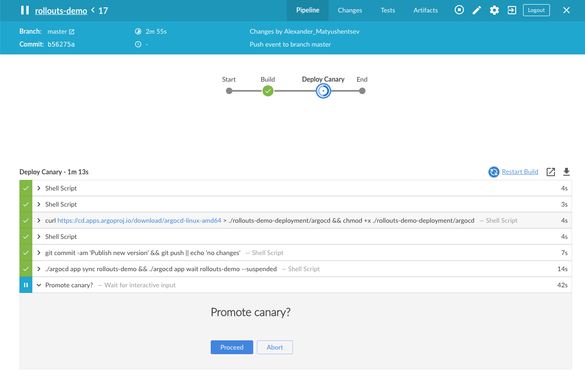

# Argo Rollouts Demo Application

This repo contains the [Argo Rollouts](https://github.com/argoproj/argo-rollouts) demo application source code and examples. It demonstrates the
various deployment strategies and progressive delivery features of Argo Rollouts.



## Examples

The following examples are provided:

| Example | Description |
|---------|-------------|
| [Canary](examples/canary) | Rollout which uses the canary update strategy |
| [Blue-Green](examples/blue-green) |  Rollout which uses the blue-green update strategy |
| [Canary Analysis](examples/analysis) | Rollout which performs canary analysis as part of the update. Uses the prometheus metric provider. |
| [Experiment](examples/experiment) | Experiment which performs an A/B test. Performs analysis against the A and B using the job metric provider |
| [Preview Stack Testing](examples/preview-testing) | Rollout which launches an experiment that tests a preview stack (which receives no production traffic) |
| [Canary with istio (1)](examples/istio) | Rollout which uses host-level traffic splitting during update |
| [Canary with istio (2)](examples/istio-subset) | Rollout which uses subset-level traffic splitting during update |

Before running an example:

1. Install Argo Rollouts

- See the document [Getting Started](https://argoproj.github.io/argo-rollouts/getting-started/)

2. Install Kubectl Plugin

- See the document [Kubectl Plugin](https://argoproj.github.io/argo-rollouts/features/kubectl-plugin/)

To run an example:

1. Apply the manifests of one of the examples:

```bash
kustomize build <EXAMPLE-DIR> | kubectl apply -f -
```

2. Watch the rollout or experiment using the argo rollouts kubectl plugin:

```bash
kubectl argo rollouts get rollout <ROLLOUT-NAME> --watch
kubectl argo rollouts get experiment <EXPERIMENT-NAME> --watch
```

3. For rollouts, trigger an update by setting the image of a new color to run:
```bash
kubectl argo rollouts set image <ROLLOUT-NAME> "*=argoproj/rollouts-demo:yellow"
```

## Images

Available images colors are: red, orange, yellow, green, blue, purple (e.g. `argoproj/rollouts-demo:yellow`). Also available are:
* High error rate images, prefixed with the word `bad` (e.g. `argoproj/rollouts-demo:bad-yellow`)
* High latency images, prefixed with the word `slow` (e.g. `argoproj/rollouts-demo:slow-yellow`)


## Releasing

To release new images:

```bash
make release IMAGE_NAMESPACE=argoproj DOCKER_PUSH=true
```
