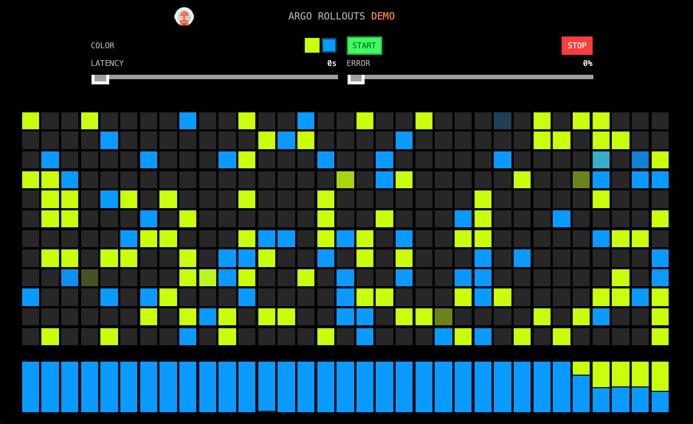

# Canary deployment using Argo Rollouts

Repository demonstrates implementation of Canary deployment using Argo Rollouts and Jenkins pipeline. Demo includes sample application, Jenkins pipeline and 
[deployment manifests](https://github.com/alexmt/rollouts-demo-deployment).

Steps:

1. Create the Argo CD application using deployment repo https://github.com/alexmt/rollouts-demo-deployment: 

```
argocd app create rollouts-demo --repo https://github.com/alexmt/rollouts-demo-deployment --path . --dest-server https://kubernetes.default.svc --dest-namespace rollouts-demo && argocd app sync rollouts-demo
```

2. Make sure application is running by visiting http://rollouts-demo.apps.argoproj.io/.
3. Register pipeline in your Jenkins instance and make a "code" change: update color defined in [color.json](./color.json), commit the change and push it to origin.
4. Navigate to Jenkins and make sure Pipeline reaches confirmation step:



5. Check application URL: http://rollouts-demo.apps.argoproj.io/ . It should be serving both production and canary responses.
6. Confirm canary promotion in jenkins. Go to step 4 and repeat.
